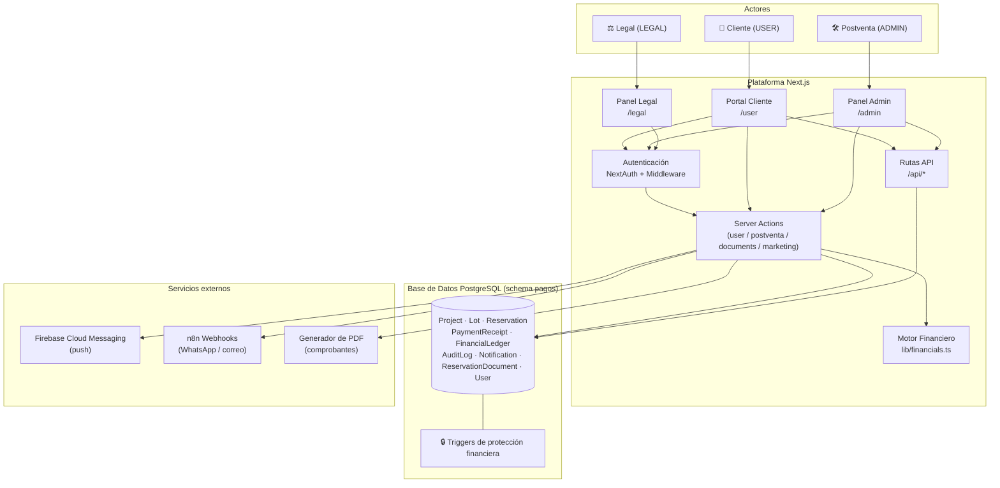
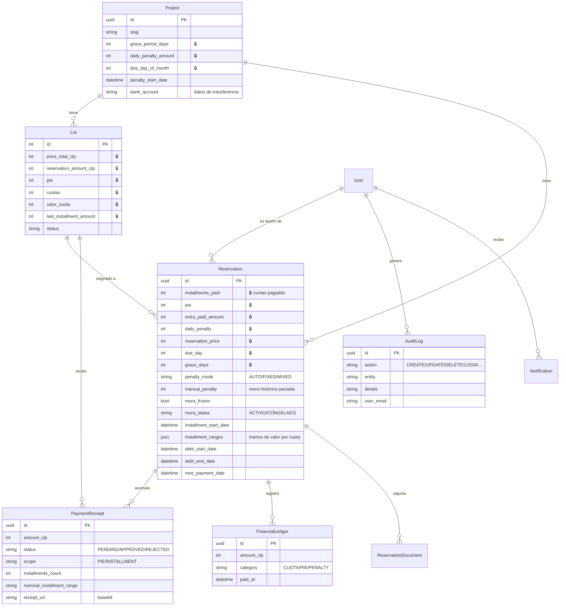
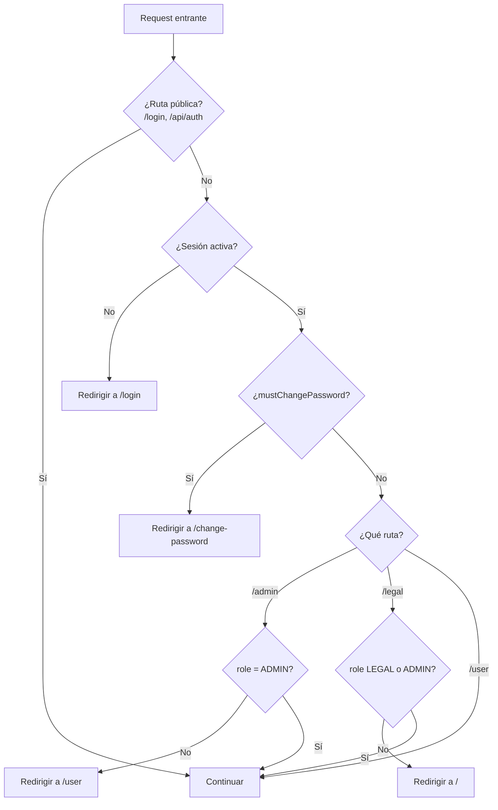
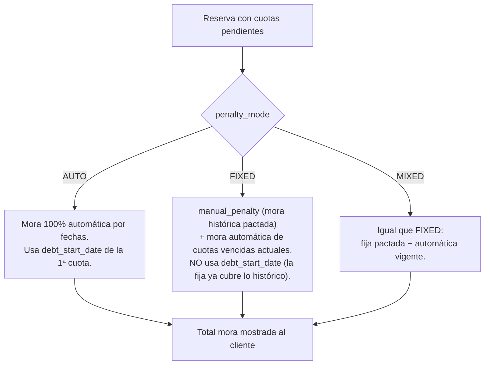
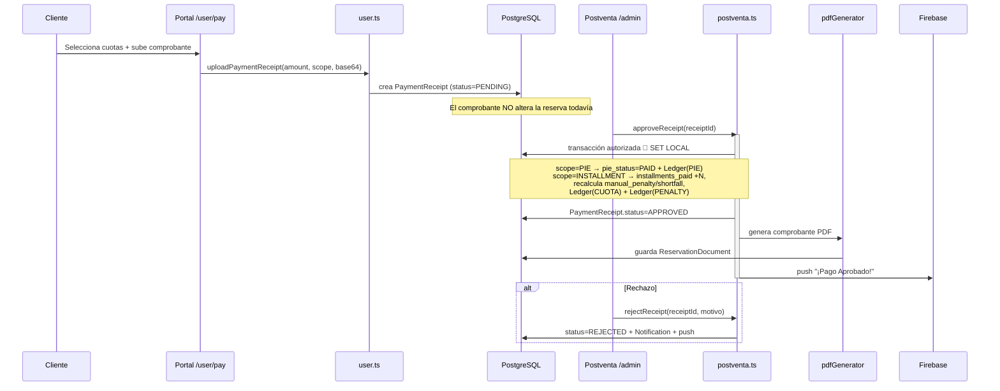
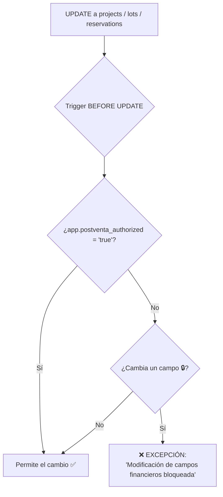
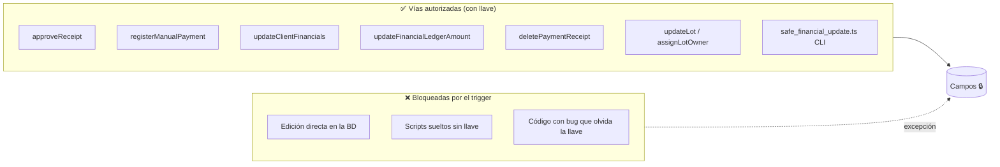

# Arquitectura del Sistema — Alimin Pagos

> Documento vivo. Describe **todo** lo que existe hoy en la plataforma: clientes, cuotas, mora,
> intereses, pagos, bitácoras, notificaciones y las protecciones de datos.
> Mantener actualizado con cada cambio relevante.
>
> **Cómo leer este documento:**
> - **Parte 1 — Resumen ejecutivo:** lenguaje simple, para gerencia y equipo de postventa.
> - **Parte 2 — Detalle técnico:** nombres de funciones, rutas API, modelos y rutas de mutación, para desarrolladores.
> - **Parte 3 — Riesgos y recomendaciones:** puntos frágiles detectados y cómo hacer cambios sin dañar los datos.

---

# PARTE 1 — RESUMEN EJECUTIVO

## ¿Qué es la plataforma?

Alimin Pagos es el portal donde los **clientes** de los proyectos inmobiliarios (Arena y Sol, Libertad y Alegría)
ven sus terrenos, sus cuotas, su mora e intereses, y **suben comprobantes de pago**. El equipo de **postventa/administración**
revisa esos pagos, los aprueba o rechaza, gestiona las fichas de los clientes y ve la caja del proyecto.

Hay tres tipos de usuario:

| Rol | Quién es | Qué puede hacer |
|-----|----------|-----------------|
| **ADMIN** | Postventa / administración | Todo: ver clientes, aprobar/rechazar pagos, editar fichas, registrar pagos manuales, generar accesos, ver reportes. |
| **USER** | Cliente comprador | Ver sus terrenos, sus cuotas y mora, subir comprobantes, ver sus documentos y notificaciones. |
| **LEGAL** | Área legal | Solo lectura de información legal/financiera de clientes (acceso restringido a su sección). |

## Los cuatro conceptos que mueven todo

1. **La Reserva (`Reservation`)** es el corazón. Cada terreno vendido a un cliente es una reserva. Ahí vive
   cuántas cuotas lleva pagadas, su pie, su mora, sus fechas y su configuración de intereses.
2. **El Comprobante (`PaymentReceipt`)** es lo que el cliente sube. Nace **PENDIENTE**, y postventa lo **APRUEBA** o **RECHAZA**.
   Solo al aprobarse, la reserva avanza (suma una cuota, registra el dinero).
3. **La Bitácora de dinero (`FinancialLedger`)** registra cada peso que entra: cuotas, pie y mora. Es la base de los reportes de caja.
4. **La Bitácora de acciones (`AuditLog`)** registra quién cambió qué y cuándo. Es la trazabilidad.

## Las "cajas fuertes" de los datos financieros

La preocupación central es: **que los datos del cliente no se modifiquen de la nada**. Para eso existe una
protección a nivel de base de datos (3 *triggers* de PostgreSQL) que **bloquea** cualquier cambio a campos
financieros sensibles, a menos que el cambio venga por una vía **autorizada** de la plataforma.

Piensa en ello como una caja fuerte: los montos, el pie, la cantidad de cuotas y las cuotas pagadas están
protegidos. Ni un script suelto, ni una edición directa a la base, ni un error de código pueden tocarlos
sin la "llave" (`app.postventa_authorized`). Las pantallas de postventa **sí** tienen esa llave, así que el
equipo trabaja normal; lo que se bloquea es todo lo que venga por fuera.

## Mapa general del sistema



---

# PARTE 2 — DETALLE TÉCNICO

## 1. Stack y estructura

- **Framework:** Next.js (App Router) con Server Actions (`"use server"`).
- **Base de datos:** PostgreSQL, esquema `pagos`, accedida vía **Prisma**.
- **Autenticación:** NextAuth v5 (Credentials + JWT).
- **Notificaciones:** Firebase Admin (FCM) + webhooks n8n para WhatsApp/correo.
- **Zona horaria:** todos los cálculos se anclan a **America/Santiago** vía `getSantiagoUTCDate` / `getChileToday`.

| Carpeta | Contenido |
|---------|-----------|
| `src/actions/postventa.ts` | ~30 server actions de administración (el archivo más grande y crítico). |
| `src/actions/user.ts` | Server actions del portal del cliente. |
| `src/actions/documents.ts` | Subida/listado/borrado de documentos. |
| `src/actions/marketing.ts` | Correos masivos por proyecto. |
| `src/lib/financials.ts` | Motor de cálculo de vencimientos, mora e intereses. |
| `src/lib/prisma.ts` | Cliente Prisma (singleton). |
| `src/lib/cache.ts` | Caché en memoria con TTL. |
| `src/lib/notifications.ts` | Envío de push vía Firebase. |
| `src/lib/pdfGenerator.ts` | Generación de comprobantes PDF. |
| `src/app/api/*` | Rutas API REST. |
| `src/scripts/*` | Scripts de mantenimiento y el job de alertas diarias. |
| `prisma/migrations_manual/*` | Los triggers de protección financiera (SQL manual). |

## 2. Modelo de datos relacional



**🔒 = campo protegido por trigger** (ver sección 8). El resto de campos de `Reservation` (mora, fechas,
`penalty_mode`, `installment_ranges`) **no** están protegidos a nivel de base de datos — ver Riesgos.

## 3. Autenticación y control de acceso

**Login (`src/auth.ts`):** NextAuth con proveedor Credentials.
- Acepta **email o RUT**. Si no contiene `@`, limpia el RUT y busca la reserva asociada para resolver el email.
- Verifica la contraseña con `bcrypt.compare`.
- Al entrar con éxito, actualiza `last_login_at`.
- Emite un JWT que lleva `role`, `id`, `mustChangePassword`, `allowedProjects`.

**Middleware (`src/middleware.ts`):** protege rutas por rol en cada request.



**Gestión de contraseñas:**
- `POST /api/auth/change-password` — cambio con contraseña actual (limpia `must_change_password`, sella `password_changed_at`).
- `requestPasswordReset(email)` / `resetPassword(token, newPassword)` — flujo de recuperación por token con expiración de 1 hora.
- `activateClientProfile(reservationId)` y `generateTemporaryPassword(reservationId)` — generan clave temporal, la hashean, activan el portal y **disparan webhook n8n** con las credenciales (WhatsApp/correo).

## 4. Motor financiero (`lib/financials.ts`)

Es el cerebro de los cálculos. Cuatro funciones puras (sin efectos de base de datos salvo `getProjectConfig`):

| Función | Qué calcula |
|---------|-------------|
| `getInstallmentDueDate(inicio, n, díaPago)` | Fecha de vencimiento de la cuota N. Fórmula: mes de inicio + (N−1), al día de pago configurado. Todo en UTC 12:00 para evitar corrimientos de zona horaria. |
| `getSantiagoUTCDate(date)` / `getChileToday()` | Normalizan cualquier fecha al día calendario de Chile. |
| `calculateTotalInterest(...)` | Mora de **una** cuota: aplica período de gracia, respeta `debt_start_date` (inicio manual de deuda), `debt_end_date` (corte de mora), y `penalty_start_date` (fecha desde la cual el proyecto cobra mora). Devuelve `días_atraso × multa_diaria`. |
| `calculateAggregatedAutoPenalty(...)` | Recorre **todas** las cuotas pendientes y suma la mora automática de cada una. El `next_payment_date` (override del admin) aplica solo a la primera cuota pendiente; `debt_start_date` también solo a la primera. |

### Los tres modos de mora (`penalty_mode`)



- **AUTO:** el sistema calcula todo según fechas y días de atraso.
- **FIXED / MIXED:** hay un monto fijo pactado (`manual_penalty`, la "mora histórica") que se suma como un ítem
  aparte ("Intereses Anteriores"), más la mora automática de las cuotas que se vayan venciendo. En estos modos
  el cálculo automático **no** usa `debt_start_date`, porque el monto fijo ya representa la deuda histórica.
- **Congelamiento:** si `mora_frozen = true` o `mora_status = "CONGELADO"`, la mora automática se detiene (queda en 0).

> ⚠️ El bug de "mora duplicada" (junio 2026) vivía aquí: en el portal, `penaltyAmount` sumaba el ítem histórico
> y luego se volvía a sumar `moraHistorica`. Corregido usando solo las cuotas reales (`c.number > 0`).

## 5. Ciclo de vida de un pago (flujo central)



**Puntos clave del flujo:**
- El comprobante subido por el cliente **no toca la reserva**. Solo queda PENDIENTE.
- Recién al **aprobar**, postventa avanza `installments_paid`, escribe en la bitácora de dinero y recalcula la mora.
- La imputación del pago es **primero a la cuota, luego a la mora** (`cuotaPaidAmount` vs `penaltyPaidAmount`).
  Si el pago no cubre lo esperado, el faltante (`shortfall`) se guarda como `manual_penalty` y el modo pasa a FIXED/MIXED.
- El **pago manual** (`registerManualPayment`) hace lo mismo sin comprobante del cliente: postventa lo registra directo (efectivo/transferencia offline).

## 6. Las dos bitácoras

| | `FinancialLedger` (dinero) | `AuditLog` (acciones) |
|---|---|---|
| **Registra** | Cada peso que entra: `CUOTA`, `PIE`, `PENALTY` | Quién hizo qué: `CREATE/UPDATE/DELETE/LOGIN...` |
| **Se usa para** | Reportes de caja e ingresos | Trazabilidad y cumplimiento |
| **Alimentada por** | `approveReceipt`, `registerManualPayment`, `assignLotOwner` | `updateFinancialLedgerAmount`, `updateLot`, `assignLotOwner`, `addClientNote`, script CLI seguro |
| **Consultada por** | `getFinancialHistory`, `getProjectLedgerStats`, `getIncomeAnalytics` | (lectura directa/manual) |

## 7. Catálogo completo de funciones

### 7.1 Server Actions — Portal del cliente (`src/actions/user.ts`)

| Función | Propósito | Escribe en |
|---------|-----------|------------|
| `getUserLots()` | Devuelve todos los terrenos del cliente con cálculo de cuotas, mora, próximos vencimientos y documentos. | — (lectura, cacheada) |
| `uploadPaymentReceipt(...)` | Cliente sube comprobante (queda PENDING). | `PaymentReceipt` |
| `updateFcmToken(token)` | Guarda el token de push del dispositivo. | `User.fcm_token` |
| `requestPasswordReset(email)` | Genera token de recuperación. | `User.reset_password_*` |
| `resetPassword(token, pwd)` | Cambia la contraseña vía token. | `User.password` |
| `getUserNotifications()` | Lista las notificaciones in-app. | — |
| `markNotificationAsRead(id)` | Marca notificación como leída. | `Notification.read` |

### 7.2 Server Actions — Administración (`src/actions/postventa.ts`)

| Función | Propósito | Toca campos 🔒 |
|---------|-----------|:---:|
| `getFullPostventaData({projectSlug})` | Dashboard completo de reservas con cálculos. | — |
| `getAdminProjects()` | Proyectos disponibles para el admin. | — |
| `getPendingReceipts(slug)` / `getAllReceipts(slug)` | Bandeja de comprobantes. | — |
| `approveReceipt(id)` | Aprueba pago, avanza cuota, escribe ledger, PDF, push. | ✅ `installments_paid` |
| `rejectReceipt(id, motivo)` | Rechaza pago, notifica al cliente. | — |
| `registerManualPayment(...)` | Registra pago offline. | ✅ `installments_paid` |
| `deletePaymentReceipt(id)` | Elimina comprobante y revierte la cuota. | ✅ `installments_paid` |
| `updateReservation(id, data)` | Actualización genérica de reserva. | ✅ (potencial) |
| `updateClientProfile(id, data)` | Edita datos personales y email de login. | — |
| `updateClientFinancials(id, lotId, data)` | Edita finanzas de lote + reserva. | ✅ varios |
| `updateFinancialLedgerAmount(...)` | Corrige monto de un registro de caja + regenera PDF. | ✅ `installments_paid` |
| `updateMoraDates(id, ini, fin)` | Ajusta `debt_start_date`/`debt_end_date`. | — |
| `toggleMultiLot(id, estado)` | Marca multi-lote. | — |
| `toggleAlContado(id, estado)` | Marca reserva como pagada al contado (COMPLETED). | — |
| `getClientPOV(id)` | Vista previa: lo que ve el cliente. | — |
| `getFinancialHistory(id)` | Historial de caja de una reserva. | — |
| `getProjectLedgerStats(slug, mes, año)` | Suma recaudación y mora por período. | — |
| `getIncomeAnalytics(slug)` | Agregación mensual de ingresos (desde may-2026). | — |
| `getAdminLots(slug)` / `createLot(...)` / `updateLot(...)` | Inventario de lotes. | ✅ (updateLot/createLot) |
| `assignLotOwner(...)` | Asigna dueño a un lote: crea usuario + reserva. | ✅ (update lote a "sold") |
| `activateClientProfile(id)` | Activa portal + envía credenciales por n8n. | — |
| `generateTemporaryPassword(id)` | Regenera clave + reenvía credenciales por n8n. | — |
| `getClientNotes(id)` / `addClientNote(...)` | Notas internas de la ficha. | — |
| `invalidatePostventaCache()` | Limpia la caché de postventa. | — |

### 7.3 Otras server actions

- **Documentos (`documents.ts`):** `uploadDocument`, `getReservationDocuments`, `deleteDocument`.
- **Marketing (`marketing.ts`):** `getProjectEmails`, `sendBulkEmail`.

### 7.4 Rutas API REST (`src/app/api/*`)

| Ruta | Método | Auth | Propósito |
|------|--------|------|-----------|
| `/api/auth/[...nextauth]` | * | — | Endpoints de NextAuth (login/logout/sesión). |
| `/api/auth/change-password` | POST | Sesión | Cambio de contraseña con validación de la actual. |
| `/api/documents/[id]` | GET | Sesión + dueño/ADMIN/LEGAL | Sirve documentos y comprobantes (detecta tipo, fuerza descarga opcional). |
| `/api/lots?project=slug` | GET | ADMIN | Lista lotes de un proyecto para el panel. |

### 7.5 Procesos en segundo plano

- **`src/scripts/daily_notifications.ts`** — recorre reservas activas, recalcula estado de mora y envía push
  vía FCM **solo cuando el estado empeora** (compara con `last_notified_status`). Debe ejecutarse como **cron diario**.
- **`src/scripts/safe_financial_update.ts`** — CLI para editar campos financieros manualmente **de forma segura**:
  hace respaldo en disco → abre transacción con `SET LOCAL app.postventa_authorized` → aplica cambio →
  escribe en `AuditLog` → imprime el *diff*. **Esta es la vía correcta para correcciones manuales en BD.**

## 8. 🔒 Protección de datos financieros (el énfasis)

### Cómo funciona

En `prisma/migrations_manual/01_financial_protection_triggers.sql` hay **3 triggers `BEFORE UPDATE`** (uno por
tabla) que lanzan una excepción si se intenta modificar un campo financiero **sin** la variable de sesión
`app.postventa_authorized = 'true'`.



### Qué campos protege cada trigger

| Tabla | Campos protegidos 🔒 |
|-------|----------------------|
| `projects` | `grace_period_days`, `daily_penalty_amount`, `due_day_of_month` |
| `lots` | `price_total_clp`, `reservation_amount_clp`, `pie`, `cuotas`, `valor_cuota`, `last_installment_amount` |
| `reservations` | `pie`, `installments_paid`, `extra_paid_amount`, `pending_amount`, `daily_penalty`, `reservation_price`, `last_installment_value`, `due_day`, `grace_days` |

### La "llave": `SET LOCAL app.postventa_authorized`

Toda server action que necesite tocar un campo protegido **debe** hacerlo dentro de una transacción que primero
active la llave:

```ts
await prisma.$transaction(async (tx) => {
  await tx.$executeRawUnsafe(`SET LOCAL app.postventa_authorized = 'true'`);
  await tx.reservation.update({ where: { id }, data: { installments_paid: { increment: 1 } } });
});
```

`SET LOCAL` limita la llave a **esa transacción**; al terminar, se desactiva sola. Las funciones ya autorizadas
son: `updateReservation`, `approveReceipt`, `registerManualPayment`, `updateFinancialLedgerAmount`,
`updateClientFinancials`, `deletePaymentReceipt`, `updateLot`, `assignLotOwner` y el script `safe_financial_update.ts`.

### Vías de mutación de datos del cliente (mapa completo)



> **Importante:** los triggers son `BEFORE UPDATE`, **no** cubren `INSERT`. Crear una reserva nueva
> (`assignLotOwner`) no dispara el bloqueo; sí lo dispara marcar el lote como "sold" (que es un UPDATE).

## 9. Integraciones externas

| Servicio | Uso | Dónde |
|----------|-----|-------|
| **Firebase Cloud Messaging** | Push a la app del cliente (pago aprobado/rechazado, alertas de mora). | `lib/notifications.ts`, `daily_notifications.ts` |
| **n8n (webhooks)** | Envío de credenciales por WhatsApp/correo al activar o regenerar acceso. Una URL por proyecto. | `activateClientProfile`, `generateTemporaryPassword` |
| **Generador de PDF** | Comprobante oficial al aprobar/registrar un pago. | `lib/pdfGenerator.ts` |
| **Caché en memoria** | Reduce consultas repetidas (TTL 5 min, prefijos `postventa_`, `user_data_`, `receipts_`). | `lib/cache.ts` |

---

# PARTE 3 — RIESGOS Y RECOMENDACIONES

> Hallazgos detectados al mapear el sistema. Ordenados por impacto sobre la integridad de los datos del cliente.

## 🔴 Alto impacto

1. **Campos financieros sensibles SIN protección de trigger.**
   El trigger de `reservations` **no** cubre `manual_penalty`, `penalty_mode`, `mora_frozen`, `mora_status`,
   `debt_start_date`, `debt_end_date`, `next_payment_date` ni `installment_ranges`. Estos definen **la mora y los
   tramos de valor de cuota** — justo donde vivió el bug de la mora duplicada. Una edición directa a la BD podría
   alterarlos sin bloqueo.
   **Recomendación:** extender los tres triggers para cubrir estos campos, o documentar formalmente que son
   "editables" y por qué.

2. **Fragilidad en la sincronización de contraseña temporal.**
   `temp_password` (texto plano en BD) y `password` (hash) pueden quedar **desincronizados** si se regenera la
   clave dos veces muy seguido (caso Luis Bernal). El botón mostraba una clave que ya no correspondía al hash.
   **Recomendación:** no mostrar nunca `temp_password` cacheado como fuente de verdad; regenerar siempre al pedir
   acceso (ya aplicado en el botón). Evaluar dejar de guardar `temp_password` en claro tras el primer login.

3. **`resetPassword` / `requestPasswordReset` con debilidades de seguridad.**
   El token se genera con `Math.random()` (no criptográficamente seguro) y `requestPasswordReset` **devuelve el
   token en la respuesta** (resto de desarrollo). Sin rate-limiting en login ni en recuperación.
   **Recomendación:** usar `crypto.randomBytes`, no devolver el token al cliente, y agregar rate-limiting.

## 🟠 Impacto medio

4. **Comprobantes y documentos guardados como base64 en la base de datos.**
   `PaymentReceipt.receipt_url` y `ReservationDocument.base64_content` almacenan archivos completos en columnas de
   texto. Esto infla la BD, encarece backups y presiona memoria al servir/leer.
   **Recomendación:** migrar a almacenamiento de objetos (S3/Cloud Storage) y guardar solo la URL.

5. **`deletePaymentReceipt` revierte la caja con una heurística de tiempo.**
   Para borrar el registro de `FinancialLedger` asociado, hace `deleteMany` buscando por monto y una ventana de
   ±5 segundos alrededor de `processed_at`. Es frágil: podría borrar el registro equivocado o no encontrarlo.
   **Recomendación:** enlazar `FinancialLedger` con `PaymentReceipt` por FK y borrar por ese enlace.

6. **Caché en memoria por instancia.**
   `memoryCache` vive en el proceso. Si la app corre en **múltiples instancias**, invalidar en una no invalida en
   las otras → datos desactualizados entre instancias.
   **Recomendación:** usar caché compartida (Redis) o revalidación por tags si se escala horizontalmente.

7. **Imputación histórica de mora es heurística.**
   `approveReceipt` reconoce en el código que calcular la mora histórica exacta "es complejo" y usa un faltante
   crudo (`shortfall`). Puede sub/sobre-atribuir mora en casos límite.
   **Recomendación:** definir reglas explícitas y cubrirlas con pruebas.

## 🟡 Menor / higiene

8. **`debug: true` forzado en `auth.ts`** — imprime información sensible en logs. Desactivar en producción.
9. **`daily_notifications.ts` debe estar agendado.** Si no hay cron activo, no se envían alertas de mora. Verificar el scheduler.
10. **Sin `AuditLog` en algunas mutaciones** (p. ej. `toggleAlContado`, `toggleMultiLot`). Considerar registrarlas para trazabilidad completa.

## Guía: cómo agregar funcionalidad sin dañar los datos

1. **¿Tu cambio escribe un campo 🔒?** → hazlo dentro de `prisma.$transaction` con
   `SET LOCAL app.postventa_authorized = 'true'` como primera línea. Nunca uses `prisma.$transaction([array])`
   para campos protegidos (no permite `SET LOCAL`).
2. **¿Corrección manual en la BD?** → usa `safe_financial_update.ts` (respaldo + llave + auditoría), nunca SQL directo.
3. **¿Nuevo movimiento de dinero?** → escribe en `FinancialLedger` con la categoría correcta (`CUOTA/PIE/PENALTY`)
   para que caja y reportes cuadren.
4. **¿Tocas la mora?** → recuerda los tres modos (AUTO/FIXED/MIXED) y que el ítem "histórico" (`number === 0`)
   se maneja aparte de las cuotas reales en el portal.
5. **¿Cambias el modelo?** → actualiza este documento y evalúa si el nuevo campo debe entrar a los triggers.
6. **Siempre** invalida la caché (`memoryCache.deleteByPrefix(...)`) tras una mutación, como hacen las acciones actuales.

---

*Última actualización: generado a partir del estado del código en la rama `v2`.*
